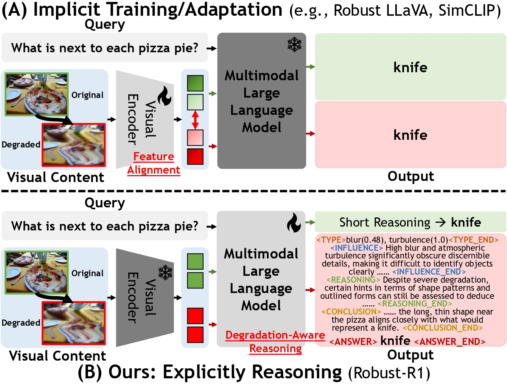

<div align="center">

# [AAAI 2026 Oral] Robust-R1: Degradation-Aware Reasoning for Robust Visual Understanding


[Jiaqi Tang](https://jqt.me/), 
[Jianmin Chen](), 
[Wei Wei](https://scholar.google.com/citations?hl=zh-CN&user=v8KMYlwAAAAJ), 
[Xiaogang Xu](https://xuxiaogang.com/), 
[Runtao Liu](https://scholar.google.com/citations?hl=zh-CN&user=YHTvXF4AAAAJ), 
[Xiangyu Wu](), 
[Qipeng Xie](), 
[Jiafei Wu](), 
[Lei Zhang](https://scholar.google.com/citations?hl=zh-CN&user=0Kg6Gi4AAAAJ), 
and [Qifeng Chen](https://scholar.google.com/citations?hl=zh-CN&user=lLMX9hcAAAAJ)


[](https://arxiv.org/abs/your-paper-id)
[](https://huggingface.co/Jiaqi-hkust/Robust-R1)
[](https://huggingface.co/datasets/Jiaqi-hkust/Robust-R1)
<!-- [](LICENSE)
[](https://youtube.com/link-to-demo) -->
</div>

<br/>

---
## 📰 **News**
- **[2025-12-01]** 🔥 We release the training code, [model weights](https://huggingface.co/Jiaqi-hkust/Robust-R1), and the [Dataset](https://huggingface.co/datasets/Jiaqi-hkust/Robust-R1) is now available on HuggingFace.
- **[2025-11-08]** 🚀 Our paper is accepted by **AAAI 2026**!


---

## 🔭 **Motivation**

- 🚩 **Limited Interpretability**: Lack of explicit mechanisms to diagnose degradation impacts on original semantic information.
- 🚩 **Isolated Optimization**: Neglect of the degradation propagation relation between the visual encoder and large language model.

<div align="center">
  
  <br>
</div>

---

## 🛠️ **Installation**


**Create environment:**
   ```bash
   conda create -n your_env_name python=3.10
   conda activate your_env_name
   bash setup.sh
   ```
---
## 🧠 Training

### 🎓 Supervised Fine-Tuning

We employ [LLaMA-Factory](https://github.com/hiyouga/LLaMA-Factory) for supervised fine-tuning of the base model.

1. Clone the repository and install required dependencies:

   ```bash
   git clone --depth 1 https://github.com/hiyouga/LLaMA-Factory.git
   cd LLaMA-Factory
   pip install -e ".[torch,metrics]"
   ```

2. Run the training command:

   ```bash
   llamafactory-cli train examples/train_full/qwen2_5_vl_full_sft.yaml
   ```

### 🎓 Reinforcement Learning

1. Download [Robust images](https://huggingface.co/datasets/Jiaqi-hkust/Robust-R1) and unzip it.

2. Replace the following part in the [run_scripts/run_grpo_robust.sh](run_scripts/run_grpo_robust.sh) file with your own paths:

   ```bash
   data_paths="your_data_path" 
   image_folders="your_images_folder"
   model_path="your_model_name_or_path"
   ```

3. Run the script:

   ```bash
   bash run_scripts/run_grpo_robust.sh
   ```

---

## ⭐️ Citation
If you find Robust-R1 useful for your research and applications, please cite using this BibTeX:
   ``` latex
   
   ```
## 🤝 Acknowledgements
We thank the authors of [VLM-R1](https://github.com/om-ai-lab/VLM-R1?tab=readme-ov-file) and [LLaMA-Factory](https://github.com/hiyouga/LLaMA-Factory) for their open-source contributions.

