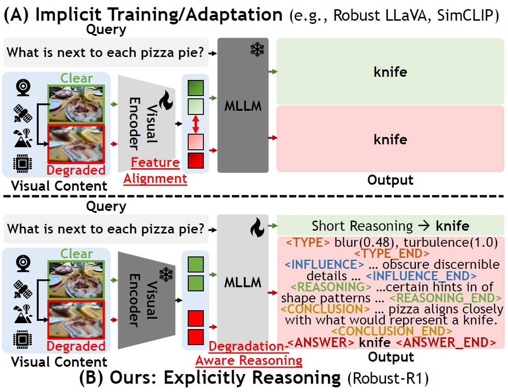
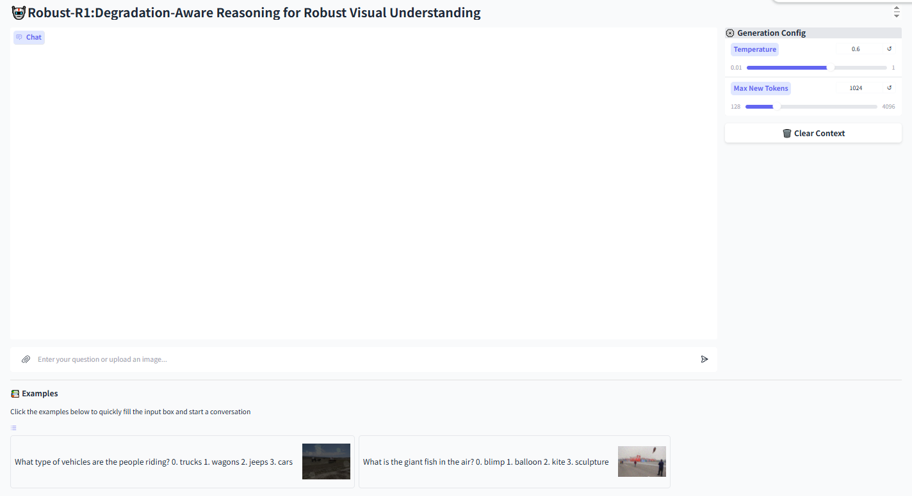

<div align="center">

# [AAAI 2026 Oral] Robust-R1: Degradation-Aware Reasoning for Robust Visual Understanding
This is the official repository for Robust-R1.


[Jiaqi Tang^](https://jqt.me/), 
[Jianmin Chen^](), 
\
[Wei Wei**](https://scholar.google.com/citations?hl=zh-CN&user=v8KMYlwAAAAJ), 
[Xiaogang Xu](https://xuxiaogang.com/), 
[Runtao Liu](https://scholar.google.com/citations?hl=zh-CN&user=YHTvXF4AAAAJ), 
[Xiangyu Wu](), 
[Qipeng Xie](), 
[Jiafei Wu](), 
[Lei Zhang](https://scholar.google.com/citations?hl=zh-CN&user=0Kg6Gi4AAAAJ) and 
\
[Qifeng Chen*](https://cqf.io)

^: Equal contribution. *: Corresponding Author. **: Co-corresponding Author.

[](https://arxiv.org/abs/your-paper-id)
[](https://huggingface.co/Jiaqi-hkust/Robust-R1)
[](https://huggingface.co/datasets/Jiaqi-hkust/Robust-R1)
[](https://code.visualstudio.com/)
[](https://opensource.org/licenses/MIT)

</div>

## 📰 **News**
- **[2025-12-01]** 🔥 Online demo is now available at [HF Space](https://huggingface.co/spaces/Jiaqi-hkust/Robust-R1).
- **[2025-12-01]** 🔥 We release the [Code](https://github.com/jqtangust/Robust-R1), [Models](https://huggingface.co/Jiaqi-hkust/Robust-R1), and [Dataset](https://huggingface.co/datasets/Jiaqi-hkust/Robust-R1) on HuggingFace.
- **[2025-12-01]** ✅ Our paper is now available on [arXiv](https://arxiv.org/abs/your-paper-id).
- **[2025-11-08]** 🚀 Our paper is accepted by **AAAI 2026 Oral**.


---

## 🔭 **Motivation**

- 🚩 **Limited Interpretability**: Lack of explicit mechanisms to diagnose degradation impacts on original semantic information.
- 🚩 **Isolated Optimization**: Neglect of the degradation propagation relation between the visual encoder and large language model.

<div align="center">
  
  <br>
</div>

---

## 🛠️ **Installation**

- **Clone the repository:**
   ```bash
   git clone https://github.com/jqtangust/Robust-R1.git
   cd Robust-R1
   ```

- **Create environment:**
   ```bash
   conda create -n robust_r1 python=3.10
   conda activate robust_r1
   bash setup.sh
   ```
---

### 🏰 **Pretrained and Fine-tuned Model**

- The following checkpoints are utilized to run Robust-R1:

  | Checkpoint | Link | Note |
  |:---------:|:----:|:----:|
  | Qwen2.5-VL-Base | [link](https://huggingface.co/Qwen/Qwen2.5-VL-3B-Instruct) | Used as initial weights for training. |
  | **Robust-R1-SFT** | [link](https://huggingface.co/Jiaqi-hkust/Robust-R1-SFT) | Fine-tuned on [Robust-R1 dataset](https://huggingface.co/datasets/Jiaqi-hkust/Robust-R1) |
  | **Robust-R1-RL** | [link](https://huggingface.co/Jiaqi-hkust/Robust-R1-RL) | Fine-tuned with reinforcement learning on [Robust-R1 dataset](https://huggingface.co/datasets/Jiaqi-hkust/Robust-R1) |

---

## ⏳ **Demo**

### 🖥️ CLI Demo

- Run the command-line demo with a question:

  ```bash
  # if you use local weight
  export MODEL_PATH="your_model_name_or_path"

  python demo.py "What type of vehicles are the people riding?\n0. trucks\n1. wagons\n2. jeeps\n3. cars\n"
  ```

### 🌐 GUI Demo

- Set the model path as an environment variable and run the demo:

  ```bash
  # if you use local weight
  export MODEL_PATH="your_model_name_or_path"
  
  python app.py
  ```

- The demo will be available at `http://localhost:7860` by default.

- GUI [Online Demo](https://huggingface.co/spaces/Jiaqi-hkust/Robust-R1). 

  <div align="center">
    
  </div>

---

## 🧠 **Training**

### 🎓 Supervised Fine-Tuning

We employ [LLaMA-Factory](https://github.com/hiyouga/LLaMA-Factory) for supervised fine-tuning of the base model.

1. Clone the repository and install required dependencies:

   ```bash
   git clone --depth 1 https://github.com/hiyouga/LLaMA-Factory.git
   cd LLaMA-Factory
   pip install -e ".[torch,metrics]"
   ```

2. Download the base model [Qwen2.5-VL-3B-Instruct](https://huggingface.co/Qwen/Qwen2.5-VL-3B-Instruct).

3. Prepare the training data and configuration files:

   - Download the [Robust images](https://huggingface.co/datasets/Jiaqi-hkust/Robust-R1) and unzip it.
   - Modify the configuration files in the `LLaMA-Factory/data` directory.

4. Configure the training YAML file with your local paths (model path, data path, output directory.).

5. Run the training command to train the SFT model:

   ```bash
   llamafactory-cli train examples/train_full/qwen2_5_vl_full_sft.yaml
   ```

### 🎓 Reinforcement Learning

1. Download [Robust images](https://huggingface.co/datasets/Jiaqi-hkust/Robust-R1) and unzip it in `Robust-R1/dataset`.

2. Prepare the training data file (train.jsonl) and organize the image folders.

3. Download the SFT model checkpoint from [Robust-R1-SFT](https://huggingface.co/Jiaqi-hkust/Robust-R1-SFT) or use your own trained SFT model.

4. Replace the following part in the [run_scripts/run_grpo_robust.sh](run_scripts/run_grpo_robust.sh) file with your own paths:

   ```bash
   data_paths="Robust-R1/data/train.jsonl" 
   image_folders="Robust-R1/data/train_images"
   model_path="your_model_name_or_path"
   ```

5. Run the script:

   ```bash
   bash run_scripts/run_grpo_robust.sh
   ```

---

## 📊 **Evaluation**

We use [VLMEvalKit](https://github.com/open-compass/VLMEvalKit) for anti-degradation evaluation.

1. Clone the VLMEvalKit repository and install dependencies:

   ```bash
   git clone https://github.com/open-compass/VLMEvalKit.git
   cd VLMEvalKit
   pip install -e .
   ```

2. Prepare the evaluation datasets according to VLMEvalKit requirements.

3. **Image Degradation Pipeline**: Generate corrupted images for robustness evaluation.

   We provide an image degradation pipeline for generating corrupted images to evaluate model robustness.

   Navigate to the degradation pipeline directory and process images:

   ```bash
   cd add_degradation
   python generate_pipeline_open_source.py --input_dir <input_dir> --output_base_dir <output_base_dir> --dataset_name <dataset_name> --verbose
   ```

   The script will generate three output directories with different degradation intensities for each image.

4. Configure the model path and evaluation settings in the VLMEvalKit configuration file.

5. Run the evaluation command:

   ```bash
   python run.py --model <your_model_name_or_path> --data <dataset_name>
   ```

### 🔬 R-Bench Evaluation

For R-Bench evaluation, we use [R-Bench](https://github.com/Q-Future/R-Bench) to assess model performance under real-world corruptions.

1. Clone the R-Bench repository:

   ```bash
   git clone https://github.com/Q-Future/R-Bench.git
   ```

2. Evaluate using VLMEvalKit with R-Bench dataset:

   ```bash
   cd VLMEvalKit
   python run.py --data R-Bench-Dis --model <your_model_name_or_path> --verbose
   ```

3. For full dataset evaluation, follow the R-Bench pipeline as described in the [R-Bench repository](https://github.com/Q-Future/R-Bench).

---

## ⭐️ Citation

If you find Robust-R1 useful for your research and applications, please cite using this BibTeX:
   ``` latex
   @inproceedings{tang2025robustr1,
     title={Robust-R1: Degradation-Aware Reasoning for Robust Visual Understanding},
     author={Tang, Jiaqi and Chen, Jianmin and Wei, Wei and Xu, Xiaogang and Liu, Runtao and Wu, Xiangyu and Xie, Qipeng and Wu, Jiafei and Zhang, Lei and Chen, Qifeng},
     booktitle={Proceedings of the AAAI Conference on Artificial Intelligence},
     year={2026}
   }
   ```

## 🤝 Acknowledgements
The work described in this paper was supported by a grant from the Research Grants Council of the Hong Kong Special Administrative Region, China (Project Reference Number: AoE/E-601/24-N).

We also thank the authors of [VLM-R1](https://github.com/om-ai-lab/VLM-R1?tab=readme-ov-file), [LLaMA-Factory](https://github.com/hiyouga/LLaMA-Factory), and [R-Bench](https://github.com/Q-Future/R-Bench) for their contributions.

